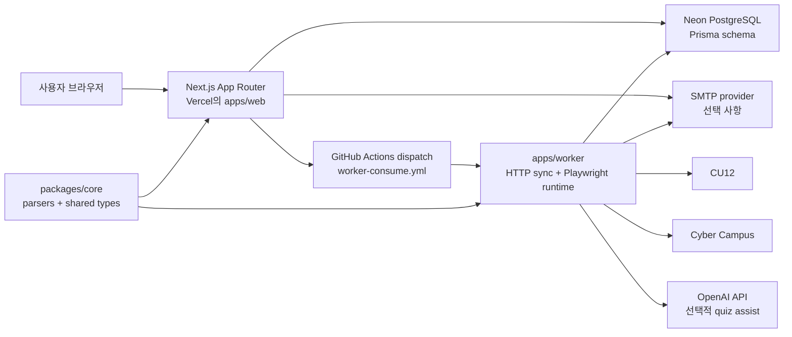
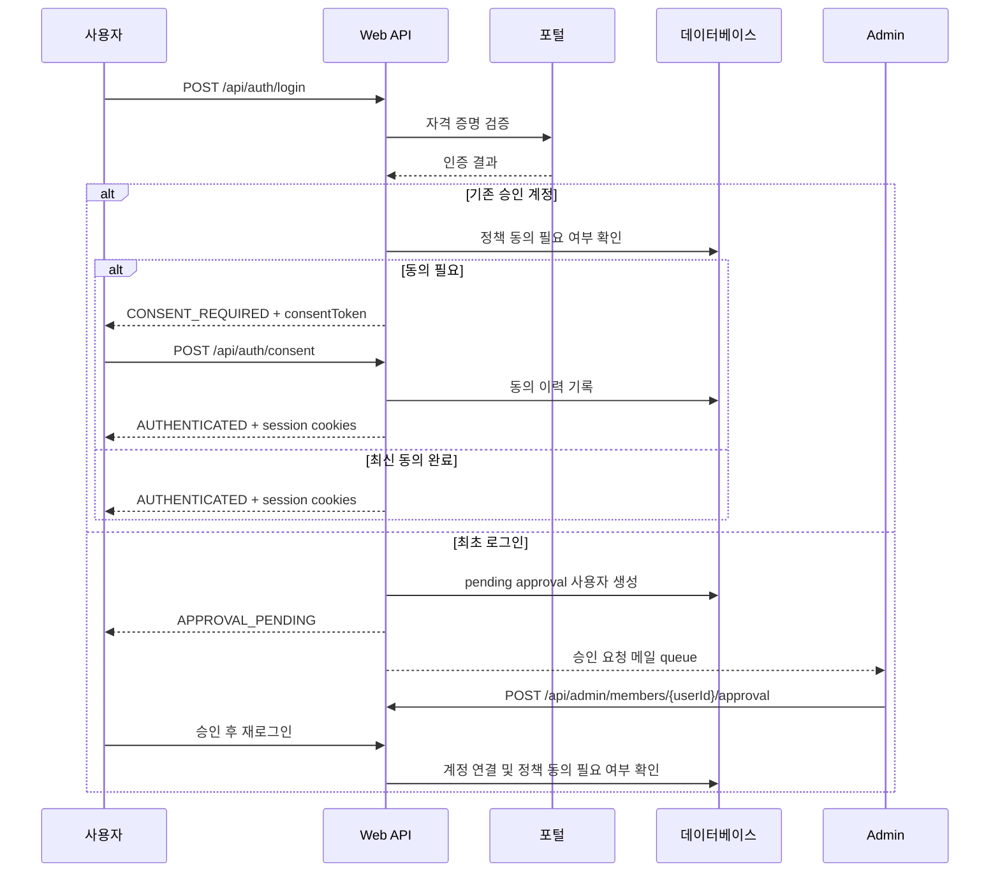
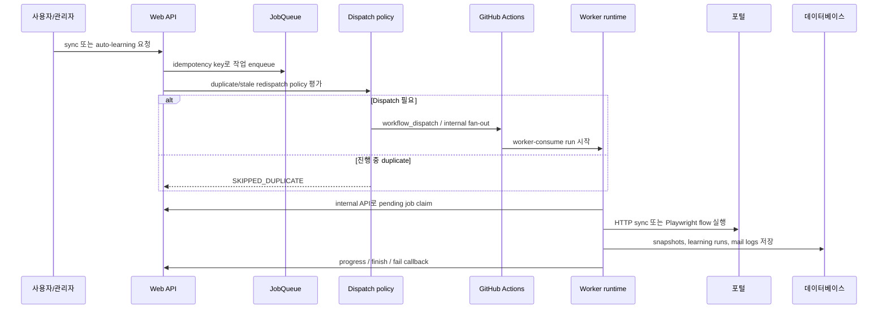
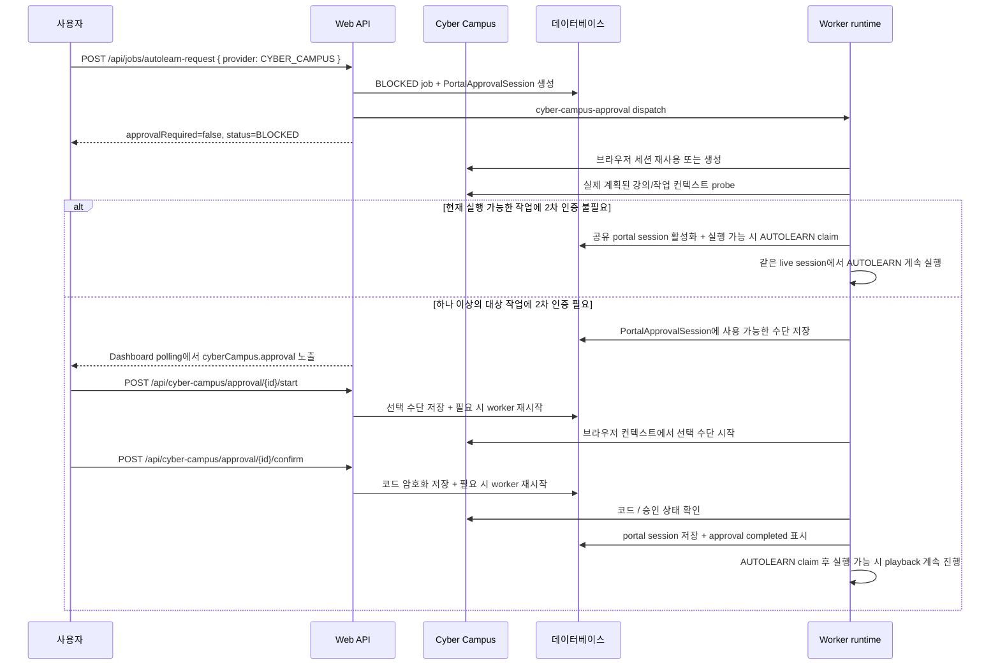

# CU12 자동화

영문 기준 문서: [`README.md`](README.md)

CU12 자동화는 CU12와 Cyber Campus를 사용하는 소규모 관리자 승인 그룹을 위한 클라우드 기반 운영 제어면입니다. 로그인할 때 실제 포털 자격 증명을 즉시 검증하고, 강의와 공지 데이터를 동기화하며, 오래 걸리는 학습 작업을 큐에 넣고, 항상 켜져 있는 개인 PC 없이도 관리자/운영 도구를 제공합니다.

## 제품 요약

| 영역 | 현재 동작 |
| --- | --- |
| 인증 | 실시간 포털 검증, 관리자 승인 기반 최초 로그인, 정책 동의 게이트, 유휴/세션 쿠키 |
| 제공자 | CU12와 Cyber Campus provider-aware 동기화 및 대시보드 뷰 |
| 학습 자동화 | VOD, 자료, 선택적 OpenAI 기반 퀴즈 실행을 포함한 큐 기반 자동 학습 |
| 워커 런타임 | HTTP 동기화 경로와 필요한 Playwright 실행을 GitHub Actions로 오케스트레이션 |
| 알림 | 마감, 정책, 승인, 자동 학습 결과용 action-required 메일과 통합 대시보드 활동 |
| 관리자 운영 | 회원 관리, 승인 요청, 워커 heartbeat 가시성, 큐 cleanup/reconcile, 정책 게시, impersonation |

## 아키텍처

### 시스템 토폴로지



### 로그인과 온보딩 흐름



### 큐 dispatch와 워커 실행



### Cyber Campus 조건부 2차 인증 자동 학습



저장된 Cyber Campus 세션이 인증된 것처럼 보이지만 빈 `todo_list` 응답을 반환하면, 워커는 fresh portal login으로 작업 계획을 한 번 다시 시도합니다. 완료된 Cyber Campus 승인에서 AUTOLEARN을 재개할 때는 fresh planning login이 승인된 세션을 버리지 않도록 승인 기반 cookie state를 복원한 뒤 강의 재생에 진입합니다.

Cyber Campus는 URL을 바꾸지 않고 `/ilos/main/main_form.acl`에서 로그인 폼을 제공할 수 있으므로, 워커는 해당 landing page를 재사용 가능한 portal session으로 신뢰하기 전에 authenticated content marker를 검증합니다.

승인 완료 시점에는 AUTOLEARN을 unblock하기 전에 정확한 대상 강의 컨텍스트를 다시 확인하며, AUTOLEARN도 redirect heuristic만 보지 않고 approval worker와 같은 secondary-auth readiness signal을 사용합니다.

실행 가능한 Cyber Campus queue item이 있는 상태에서 승인이 완료되면, 같은 worker run이 AUTOLEARN job을 claim하고 live Playwright session 안에서 playback을 계속합니다. 브라우저를 닫고 새로운 worker run에 넘기는 방식이 아닙니다.

Cyber Campus VOD playback은 실제 `viewGo(...)` 강의 action으로 시작하며, 남은 시청 시간 동안 player context를 유지하고, live `todo_list` 응답에서 강의가 사라진 뒤에만 완료로 판단합니다.

Playback worker는 중복 재생 takeover prompt, 출석 기간 warning, secondary-auth browser dialog도 자동 수락해 실제 시청 세션이 조용히 중단되지 않도록 합니다.

Approval worker가 실행 가능한 대상 작업이 더 없다고 판단하면 blocked AUTOLEARN job을 stale `PENDING`으로 되살리지 않고 no-op으로 종료합니다. 저장된 Cyber Campus 세션이 없거나 만료되었거나 이미 invalid 상태여도 AUTOLEARN은 즉시 session-required 오류로 실패하지 않고 fresh credential login으로 fallback합니다. `CYBER_CAMPUS_SECONDARY_AUTH_REQUIRED` 같은 user-action failure는 새 `PENDING` AUTOLEARN job으로 무조건 재큐잉하지 않고 `FAILED` 상태로 둡니다.

## 런타임 표면

| 표면 | 책임 |
| --- | --- |
| `apps/web` | Next.js UI + API routes, auth/session 처리, admin tools, job enqueue/dispatch, public/legal pages |
| `apps/worker` | Queue consumer, HTTP snapshot sync, Playwright auto-learning, mail rendering/delivery hooks |
| `packages/core` | Parser logic, provider helpers, queue payload types, shared contracts |
| `prisma` | Users, jobs, snapshots, policies, portal sessions, approvals, mail, audit용 PostgreSQL schema |
| `.github/workflows` | CI, deploy, bootstrap, schedule dispatch, reconcile, legacy cleanup, secret scan |

## 저장소 구조

```text
apps/
  web/          Next.js App Router UI + API
  worker/       Queue consumer and automation runtime
packages/
  core/         Shared parsers and type contracts
prisma/         PostgreSQL schema
docs/           Living docs, runbooks, ADRs, historical snapshots
scripts/        Repo automation, validation, AI workflow helpers
.github/
  workflows/    CI/CD and operational workflows
```

## 로컬 설정과 검증

```bash
corepack enable pnpm
corepack pnpm install --frozen-lockfile
corepack pnpm run check:text
corepack pnpm run check:openapi
corepack pnpm run prisma:generate
corepack pnpm run typecheck
corepack pnpm run test:all
corepack pnpm run build:web
```

참고:

- `pnpm-lock.yaml`이 바뀌었거나 Node version이 바뀌었거나 현재 worktree에 사용할 수 있는 install이 없으면 `corepack pnpm install --frozen-lockfile`을 다시 실행합니다.
- Fresh install 이후와 `prisma/schema.prisma` 또는 Prisma model usage가 바뀐 경우 `corepack pnpm run prisma:generate`를 다시 실행합니다.
- Windows에서 `pnpm`이 아직 `PATH`에 없을 수 있습니다. 저장소 표준은 `corepack pnpm`입니다.

## Codex / AI 작업 흐름

저장소는 격리된 AI 작업을 위해 `scripts/`의 PowerShell helper scripts를 사용합니다.

```bash
corepack pnpm run ai:start --task "docs-refresh"
corepack pnpm run ai:ship --commit "docs(platform): refresh architecture and runbooks" --title "docs(platform): refresh architecture and runbooks"
corepack pnpm run ai:clean
```

Named arguments는 그대로 전달합니다. 예전의 double-dash forwarding 형식은 사용하지 않습니다.

## 예정된 워크플로

| 워크플로 | 스케줄 | 현재 동작 |
| --- | --- | --- |
| `sync-schedule.yml` | `0 */2 * * *` UTC | 2시간마다 provider-aware sync work를 enqueue하고 centralized worker dispatch를 요청합니다. |
| `autolearn-dispatch.yml` | `20 0 * * *` UTC | eligible pending work가 있는 사용자에게만 daily AUTOLEARN을 queue합니다. |
| `reconcile-health-check.yml` | `0 */4 * * *` UTC | 활성 GitHub runs와 DB `RUNNING` jobs를 비교하고 divergence가 있으면 실패합니다. |
| `db-retention-cleanup.yml` | `10 1 * * *` UTC | legacy bogus course notices를 정리합니다. 수동 `user_repair`는 선택된 사용자의 notification events도 정리할 수 있습니다. |

## 환경과 설정

### 필수 application secrets

| 표면 | 변수 |
| --- | --- |
| Shared | `DATABASE_URL`, `APP_MASTER_KEY` |
| Web / Vercel | `AUTH_JWT_SECRET`, `WORKER_SHARED_TOKEN`, `CU12_BASE_URL`, `GITHUB_OWNER`, `GITHUB_REPO`, `GITHUB_WORKFLOW_ID`, `GITHUB_WORKFLOW_REF`, `GITHUB_TOKEN` |
| Worker / GitHub Actions | `WEB_INTERNAL_BASE_URL`, `WORKER_SHARED_TOKEN`, `CU12_BASE_URL`, `DATABASE_URL`, `APP_MASTER_KEY` |

### 선택 provider 및 dispatch override

| 변수 | 표면 | 목적 |
| --- | --- | --- |
| `CYBER_CAMPUS_BASE_URL` | web, worker | Cyber Campus upstream base URL override. 기본값은 production campus URL입니다. |
| `TRUST_PROXY_HEADERS` | web | 신뢰할 수 있는 proxy 뒤에서 forwarded headers를 반영합니다. |
| `WORKER_DISPATCH_MAX_PARALLEL` | web | `/internal/worker/dispatch`의 centralized worker fan-out 상한을 정합니다. |
| `AUTOLEARN_CHAIN_MAX_SECONDS` | web | continuation jobs 전체의 chained AUTOLEARN runtime 상한을 정합니다. |

### 선택 mail 및 AI 기능

| 변수 | 표면 | 목적 |
| --- | --- | --- |
| `SMTP_HOST`, `SMTP_PORT`, `SMTP_USER`, `SMTP_PASS`, `SMTP_FROM` | web, worker | action-required mail, policy/admin approval mail, test mail flows를 활성화합니다. |
| `OPENAI_API_KEY` | worker | eligible user의 quiz auto-solve를 활성화합니다. |
| `OPENAI_MODEL`, `OPENAI_TIMEOUT_MS` | worker | quiz-answering model request를 조정합니다. |

### 운영 중 자주 조정하는 워커 런타임 튜닝

| 변수 | 목적 |
| --- | --- |
| `WORKER_ONCE_IDLE_GRACE_MS` | Queue가 비었을 때 one-shot worker run의 tail을 줄입니다. |
| `AUTOLEARN_CHUNK_TARGET_SECONDS` | Continuation 전 하나의 AUTOLEARN chunk 길이를 제한합니다. |
| `AUTOLEARN_MAX_TASKS` | 한 worker run에서 처리하는 task 수를 제한합니다. |
| `AUTOLEARN_PROGRESS_HEARTBEAT_SECONDS` | 장시간 run 중 heartbeat update 간격을 제어합니다. |
| `AUTOLEARN_STALL_TIMEOUT_SECONDS` | 오래 silence가 지속되면 auto-learning run을 stalled로 판단합니다. |
| `AUTOLEARN_TIME_FACTOR` | Watch-time pacing factor를 조정합니다. Cyber Campus VOD playback은 이 값이 `1`보다 낮아도 real-time 아래로 실행하지 않습니다. |
| `PLAYWRIGHT_ACCEPT_LANGUAGE`, `PLAYWRIGHT_LOCALE`, `PLAYWRIGHT_TIMEZONE` | Browser locale 동작을 일관되게 유지합니다. |
| `PLAYWRIGHT_VIEWPORT_WIDTH`, `PLAYWRIGHT_VIEWPORT_HEIGHT` | Deterministic viewport default를 설정합니다. |
| `AUTOLEARN_HUMANIZATION_ENABLED`, `AUTOLEARN_DELAY_*`, `AUTOLEARN_NAV_SETTLE_*`, `AUTOLEARN_TYPING_DELAY_*` | Interaction을 보수적이고 안정적으로 유지합니다. |

현재 source-of-truth 변수 목록은 `.env.example`, `apps/web/src/lib/env.ts`, `apps/worker/src/env.ts`를 확인하세요.

## 운영 빠른 시작

1. GitHub Secrets와 Vercel production environment variables를 설정합니다.
2. `DB Bootstrap`을 실행합니다.
3. 최초 관리자 CU12 ID로 `Auth Reset Bootstrap`을 실행합니다.
4. Web application을 배포하고 `/api/health`가 `200`을 반환하는지 확인합니다.
5. Admin으로 로그인해 필수 policy documents를 publish하고 pending users를 approve합니다.
6. `worker-consume.yml`을 한 번 trigger하고 queue jobs가 terminal state로 진행되는지 확인합니다.
7. 정상 운영의 일부로 `Reconcile Health Check`와 `secret-scan`을 확인합니다.

## 문서

- 메인 인덱스: [`docs/00-index.md`](docs/00-index.md)
- 제품 요구사항: [`docs/01-prd.md`](docs/01-prd.md)
- 아키텍처: [`docs/02-architecture.md`](docs/02-architecture.md)
- 데이터 모델: [`docs/03-data-model.md`](docs/03-data-model.md)
- API 계약: [`docs/04-api/openapi.yaml`](docs/04-api/openapi.yaml)
- 워크플로 및 운영 runbook: [`docs/09-github-actions-runbook.md`](docs/09-github-actions-runbook.md)
- 한국어 README: [`README.ko.md`](README.ko.md)
