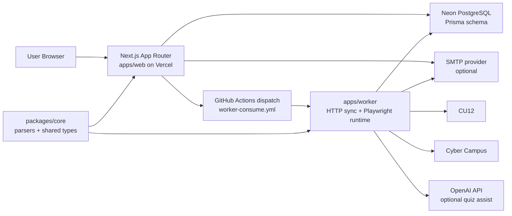
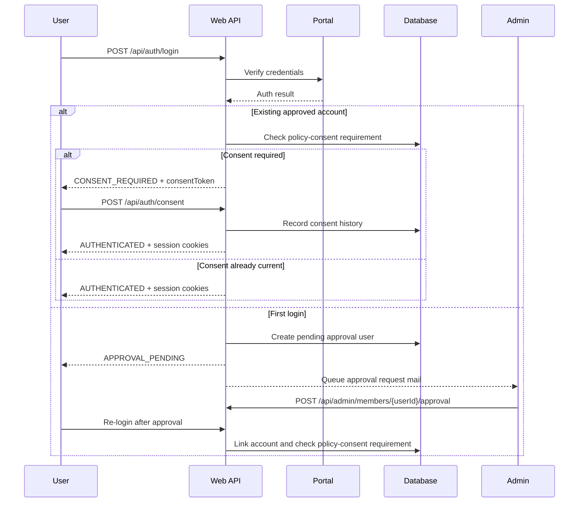
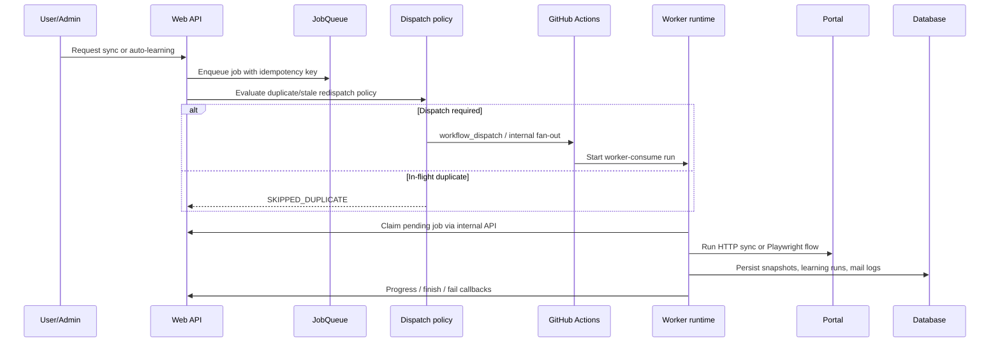
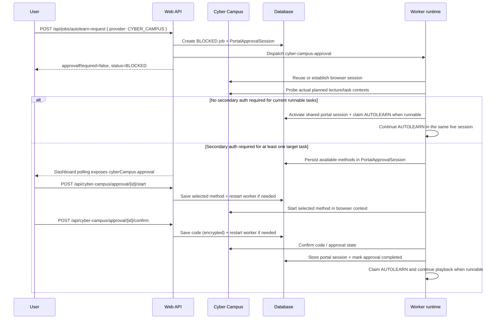

# Catholic University Automation

Korean summary: [`README.ko.md`](README.ko.md)

Catholic University Automation is a cloud-native control plane for a small administrator-approved group using CU12 and Cyber Campus. It verifies real portal credentials at login time, keeps course and notice data synchronized, queues long-running learning jobs, and exposes admin/operator tooling without requiring an always-on local machine.

## Product Snapshot

| Area | Current behavior |
| --- | --- |
| Authentication | Real-time portal verification, admin-approved first login, policy-consent gate, idle/session cookies |
| Providers | CU12 and Cyber Campus provider-aware sync and dashboard views |
| Learning automation | Queue-based auto-learning with VOD, material, and optional OpenAI-backed quiz execution |
| Worker runtime | GitHub Actions orchestration with HTTP sync paths plus Playwright execution where browser automation is required |
| Notifications | Unified dashboard activity plus action-required mail for deadlines, policy, approvals, and auto-learning results |
| Admin operations | Member management, approval requests, worker heartbeat visibility, queue cleanup/reconcile, policy publishing, impersonation |

## Architecture

### System topology



### Login and onboarding flow



### Queue dispatch and worker execution



### Cyber Campus conditional secondary-auth auto-learning



If a stored Cyber Campus session still looks authenticated but yields an empty `todo_list` response, the worker retries task planning once with a fresh portal login. When AUTOLEARN was resumed from a completed Cyber Campus approval, the worker restores the approval-backed cookie state before entering lecture playback so the fresh planning login does not discard the approved session.
Cyber Campus can serve the login form from `/ilos/main/main_form.acl` without changing the URL, so the worker now verifies authenticated content markers before trusting that landing page as a reusable portal session.
Approval completion now re-checks the exact target lecture context before unblocking AUTOLEARN, and AUTOLEARN uses the same secondary-auth readiness signal as the approval worker instead of relying only on redirect heuristics.
When approval completes with a runnable Cyber Campus queue item, the same worker run now claims that AUTOLEARN job and continues playback in the live Playwright session instead of closing the browser and handing off to a fresh worker run.
Cyber Campus VOD playback now launches through the real `viewGo(...)` lecture action, keeps the player context open for the full remaining watch time, and only confirms completion after the lecture disappears from the live `todo_list` response.
The playback worker also auto-accepts duplicate-playback takeover prompts, attendance-window warnings, and secondary-auth browser dialogs so those interruptions do not silently short-circuit a real watch session.
If the approval worker discovers there are no runnable target tasks left, it now closes the blocked AUTOLEARN job as a no-op instead of reviving it as another stale `PENDING` job.
If the saved Cyber Campus session is missing, expired, or already marked invalid, AUTOLEARN also falls back to a fresh credential login instead of failing immediately with a session-required error.
User-action failures such as `CYBER_CAMPUS_SECONDARY_AUTH_REQUIRED` are left in `FAILED` instead of being blindly re-queued as a new `PENDING` AUTOLEARN job.

## Runtime Surfaces

| Surface | Responsibility |
| --- | --- |
| `apps/web` | Next.js UI + API routes, auth/session handling, admin tools, job enqueue/dispatch, public/legal pages |
| `apps/worker` | Queue consumer, HTTP snapshot sync, Playwright auto-learning, mail rendering/delivery hooks |
| `packages/core` | Parser logic, provider helpers, queue payload types, shared contracts |
| `prisma` | PostgreSQL schema for users, jobs, snapshots, policies, portal sessions, approvals, mail, audit |
| `.github/workflows` | CI, deploy, bootstrap, schedule dispatch, reconcile, legacy cleanup, secret scan |

## Repository Layout

```text
apps/
  web/          Next.js App Router UI + API
  worker/       Queue consumer and automation runtime
packages/
  core/         Shared parsers and type contracts
prisma/         PostgreSQL schema
docs/           Living docs, runbooks, ADRs, historical snapshots
scripts/        Repo automation, validation, AI workflow helpers
.github/
  workflows/    CI/CD and operational workflows
```

## Local Setup and Validation

```bash
corepack enable pnpm
corepack pnpm install --frozen-lockfile
corepack pnpm run check:text
corepack pnpm run check:openapi
corepack pnpm run prisma:generate
corepack pnpm run typecheck
corepack pnpm run test:all
corepack pnpm run build:web
```

Notes:

- Re-run `corepack pnpm install --frozen-lockfile` when `pnpm-lock.yaml` changes, the Node version changes, or the worktree has no usable install yet.
- Re-run `corepack pnpm run prisma:generate` after a fresh install and whenever `prisma/schema.prisma` or Prisma model usage changes.
- `pnpm` may not be on `PATH` yet on Windows. The repository standard is `corepack pnpm`.

## Codex / AI Workflow

The repository uses the PowerShell-based helper scripts in `scripts/` for isolated AI work:

```bash
corepack pnpm run ai:start --task "docs-refresh"
corepack pnpm run ai:ship --commit "docs(platform): refresh architecture and runbooks" --title "docs(platform): refresh architecture and runbooks"
corepack pnpm run ai:clean
```

Use named arguments directly. Do not use the legacy double-dash forwarding form.

## Policy Documents

The live privacy policy and terms of service are stored as versioned `PolicyDocument` rows and published from the admin system page. Keep source text outside the public repository or in the admin draft flow; confirm production infrastructure regions before publishing the next active versions.

## Scheduled Workflows

| Workflow | Schedule | Current behavior |
| --- | --- | --- |
| `sync-schedule.yml` | `0 */2 * * *` UTC | Enqueue provider-aware sync work every 2 hours, then request centralized worker dispatch |
| `autolearn-dispatch.yml` | `20 0 * * *` UTC | Queue daily AUTOLEARN only for users with eligible pending work |
| `reconcile-health-check.yml` | `0 */4 * * *` UTC | Compare active GitHub runs with DB `RUNNING` jobs and fail on divergence |
| `db-retention-cleanup.yml` | `10 1 * * *` UTC | Run retention cleanup for audit logs, terminal jobs, mail deliveries, and withdrawn accounts older than 6 months; legacy notice repair still runs, and manual `user_repair` can clear a selected user's notification events |

## Environment and Configuration

### Required application secrets

| Surface | Variables |
| --- | --- |
| Shared | `DATABASE_URL`, `APP_MASTER_KEY` |
| Web / Vercel | `AUTH_JWT_SECRET`, `WORKER_SHARED_TOKEN`, `CU12_BASE_URL`, `GITHUB_OWNER`, `GITHUB_REPO`, `GITHUB_WORKFLOW_ID`, `GITHUB_WORKFLOW_REF`, `GITHUB_TOKEN` |
| Worker / GitHub Actions | `WEB_INTERNAL_BASE_URL`, `WORKER_SHARED_TOKEN`, `CU12_BASE_URL`, `DATABASE_URL`, `APP_MASTER_KEY` |

### Optional provider and dispatch overrides

| Variable | Surface | Purpose |
| --- | --- | --- |
| `CYBER_CAMPUS_BASE_URL` | web, worker | Override Cyber Campus upstream base URL (defaults to the production campus URL) |
| `TRUST_PROXY_HEADERS` | web | Honor forwarded headers when deployed behind a trusted proxy |
| `WORKER_DISPATCH_MAX_PARALLEL` | web | Cap centralized worker fan-out from `/internal/worker/dispatch` |
| `AUTOLEARN_CHAIN_MAX_SECONDS` | web | Cap total chained AUTOLEARN runtime across continuation jobs |

### Optional mail and AI features

| Variable | Surface | Purpose |
| --- | --- | --- |
| `SMTP_HOST`, `SMTP_PORT`, `SMTP_USER`, `SMTP_PASS`, `SMTP_FROM` | web, worker | Enable action-required mail, policy/admin approval mail, and test mail flows |
| `OPENAI_API_KEY` | worker | Enable quiz auto-solve for eligible users |
| `OPENAI_MODEL`, `OPENAI_TIMEOUT_MS` | worker | Tune the quiz-answering model request |

### Worker runtime tuning commonly adjusted in operations

| Variable | Purpose |
| --- | --- |
| `WORKER_ONCE_IDLE_GRACE_MS` | Shorten the tail after a one-shot worker run when the queue is empty |
| `WORKER_RETRY_WAIT_MAX_MS` | Let a one-shot worker wait for a queued retry when its `runAfter` is near |
| `AUTOLEARN_CHUNK_TARGET_SECONDS` | Limit one AUTOLEARN chunk before continuation |
| `AUTOLEARN_MAX_TASKS` | Cap tasks processed in a single worker run |
| `AUTOLEARN_PROGRESS_HEARTBEAT_SECONDS` | Control heartbeat updates during long runs |
| `AUTOLEARN_STALL_TIMEOUT_SECONDS` | Declare a stalled auto-learning run after prolonged silence |
| `AUTOLEARN_TIME_FACTOR` | Adjust watch-time pacing factor; Cyber Campus VOD playback never runs below real-time even if this value is lower than `1` |
| `PLAYWRIGHT_NAVIGATION_TIMEOUT_MS`, `PLAYWRIGHT_NAVIGATION_RETRIES`, `PLAYWRIGHT_NAVIGATION_RETRY_BASE_MS` | Tune bounded retries for transient `page.goto` failures |
| `PLAYWRIGHT_ACCEPT_LANGUAGE`, `PLAYWRIGHT_LOCALE`, `PLAYWRIGHT_TIMEZONE` | Keep browser locale behavior consistent |
| `PLAYWRIGHT_VIEWPORT_WIDTH`, `PLAYWRIGHT_VIEWPORT_HEIGHT` | Set deterministic viewport defaults |
| `AUTOLEARN_HUMANIZATION_ENABLED`, `AUTOLEARN_DELAY_*`, `AUTOLEARN_NAV_SETTLE_*`, `AUTOLEARN_TYPING_DELAY_*` | Keep interactions conservative and stable |

See `.env.example`, `apps/web/src/lib/env.ts`, and `apps/worker/src/env.ts` for the current source-of-truth variable set.

## Operations Quick Start

1. Configure GitHub Secrets and Vercel production environment variables.
2. Run `DB Bootstrap`.
3. Run `Auth Reset Bootstrap` with the initial admin CU12 ID.
4. Deploy the web application and confirm `/api/health` returns `200`.
5. Log in as admin, publish the required policy documents, and approve pending users.
6. Trigger `worker-consume.yml` once and confirm queue jobs progress to a terminal state.
7. Review `Reconcile Health Check` and `secret-scan` as part of normal operations.

## Documentation

- Main index: [`docs/00-index.md`](docs/00-index.md)
- Product requirements: [`docs/01-prd.md`](docs/01-prd.md)
- Architecture: [`docs/02-architecture.md`](docs/02-architecture.md)
- Data model: [`docs/03-data-model.md`](docs/03-data-model.md)
- API contract: [`docs/04-api/openapi.yaml`](docs/04-api/openapi.yaml)
- Workflow and operations runbook: [`docs/09-github-actions-runbook.md`](docs/09-github-actions-runbook.md)
- Korean summary: [`README.ko.md`](README.ko.md)
